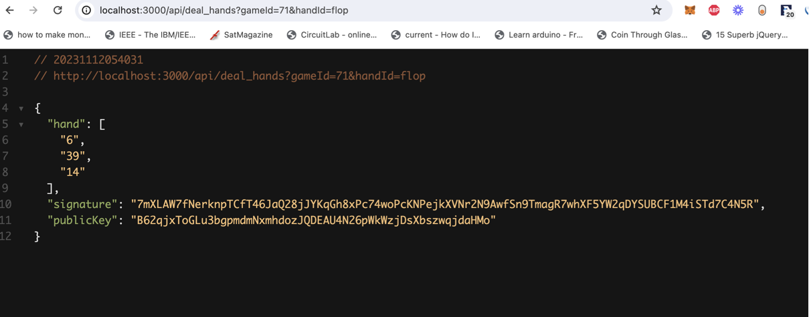

This is a [Next.js](https://nextjs.org/) project bootstrapped with [`create-next-app`](https://github.com/vercel/next.js/tree/canary/packages/create-next-app).

## Getting Started

First, run the development server:

```bash
npm run dev
# or
yarn dev
# or
pnpm dev
# or
bun dev
```

This is the Oracle for PoZker contracts that can be found here: https://github.com/tredfern0/poZKer

To use the Oracle, you have to pass in the gameId (which tracks deck for a particular game), and also what kind of handId, ehich defines what kind of hand you are calling for. The options are "take", "hole", "flop", and "river"

an example of it's usage can be seen in 
https://github.com/tredfern0/poZKer/blob/main/contracts/src/runStuff.ts

The oracle also returns a signature and public key that can be verified by the contract 
an example response looks like: 


